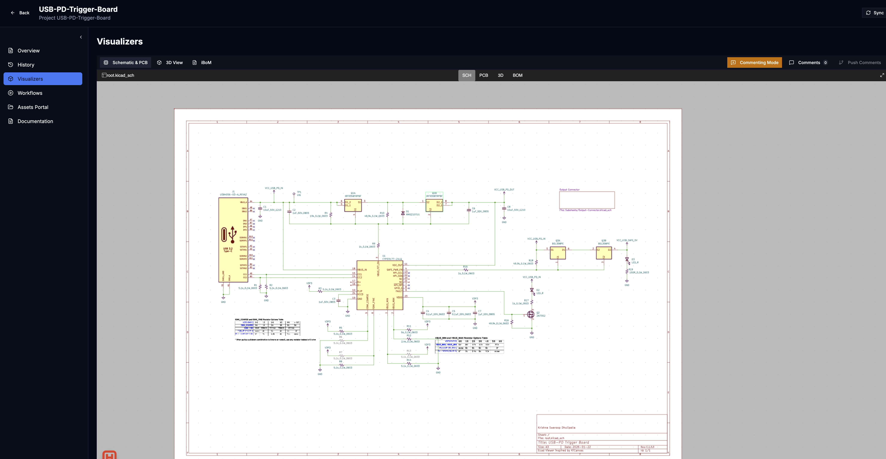
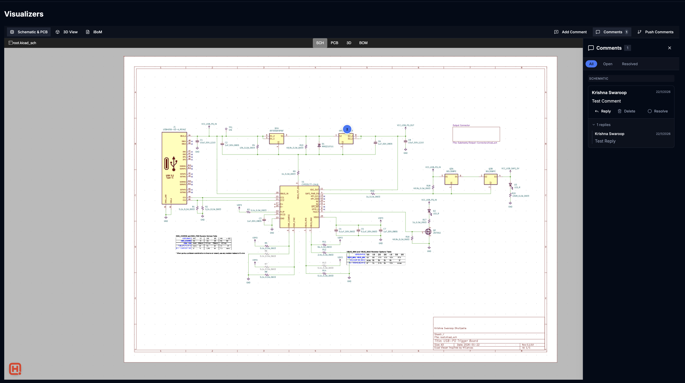

# KiCAD Prism

KiCAD Prism is a modern, high-performance web-based platform designed for visualizing, reviewing, and managing KiCAD projects. It bridges the gap between desktop EDA and collaborative cloud-native engineering by providing real-time design exploration, threaded design reviews, and automated manufacturing workflows.


---

## Key Features

### Modern Workspace Management

Manage all your KiCAD repositories in a unified dashboard. Import projects directly from GitHub via async jobs with real-time status tracking.

<p align="center">
  
  
</p>

*Unified dashboard with repository management and GitHub import flow.*

### The Visualizer Suite

A comprehensive design explorer that renders schematics and PCBs natively in the browser. Powered by [ecad-viewer](https://github.com/Huaqiu-Electronics/ecad-viewer) and [KiCanvas](https://kicanvas.org), KiCAD Prism provides high-fidelity, interactive exploration of your electronics design files.

- **Schematic & PCB**: Native rendering with cross-probing.
- **3D Visualization**: Real-time 3D model viewing with adjustable Scene Brightness and Directionality.
- **Interactive BOM**: Integrated [Interactive HTML BOM](https://github.com/quindorian/Sublime-iBOM-Plugin) suite for assembly and review.

<p align="center">
  
  
</p>

<p align="center">
  
  
</p>

*High-fidelity schematic exploration.*

### Collaborative Design Reviews

Move away from disjointed feedback. Add contextual comments directly on design elements. Comments can be replied to, resolved, and are visualised as pins in the design overlay.

<p align="center">
  
  
</p>

After a comment is added by the user, the comment is stored in a JSON file at `./comments/comments.json` inside the repository and a pin is placed on the schematic at the location where the comment was added. The pin is visible in the schematic viewer and can be clicked to view the comment.  
In the Comments Panel, the user can view all the comments and replies in a threaded manner. The user can also reply to a comment and the reply will be stored in the JSON file and can be viewed in the schematic viewer. Clicking on an entry in the comments panel will zoom into the schematic/PCB at the location where the comment was added.

<p align="center">
  
  
</p>

Pressing the Push Comments button will push the latest files in the backend to the remote repository with a commit message.

*Threaded design reviews with spatial context.*

### Integrated Documentation & Assets

Explore design and manufacturing outputs through a specialized assets portal. View project specifications and logs with native markdown support and embedded image handling.


*Native documentation browsing and asset management.*

### Automated Workflows

Trigger `kicad-cli` powered jobs directly from the browser to generate the latest PDFs, Interactive BOMs, and Ray-Traced renders.

**Customizable Workflows**: Users can add or modify whatever workflows they want by defining new scripts or modifying the existing ones in this project. Results are automatically committed and pushed back to the remote repository if configured.


---

## Tech Stack

- **Frontend**: React, Vite, Tailwind CSS, ShadCN UI, Lucide Icons.
- **Backend**: FastAPI (Python 3.10+), GitPython.
- **Tools**: `kicad-cli` (v9.0+).
- **Visualization Core**:
  - [ecad-viewer](https://github.com/Huaqiu-Electronics/ecad-viewer)
  - [KiCanvas](https://github.com/thevoidinn/KiCanvas)
  - [Interactive HTML BOM](https://github.com/quindorian/Sublime-iBOM-Plugin)
  - [Three.js](https://threejs.org/)

---

## Getting Started

For detailed installation and server setup, see [DEPLOYMENT.md](./DEPLOYMENT.md).  
For the expected structure of imported KiCAD projects, see [KICAD-PRJ-REPO-STRUCTURE.md](./KICAD-PRJ-REPO-STRUCTURE.md).

### Quick Start with Docker (Recommended)

The easiest way to run KiCAD Prism is with Docker. This works on any machine with Docker installed.

```bash
# Clone the repository
git clone https://github.com/your-username/KiCAD-Prism.git
cd KiCAD-Prism

# Start the application (no authentication)
AUTH_ENABLED=false docker compose up -d

# OR: Start with Google OAuth
GOOGLE_CLIENT_ID=your-client-id.apps.googleusercontent.com docker compose up -d

# Access the UI at http://localhost
```

To stop: `docker compose down`

#### Setting Up Google OAuth for Docker

1. Go to [Google Cloud Console](https://console.cloud.google.com/apis/credentials)
2. Create or select a project
3. Create an **OAuth 2.0 Client ID** (Web application type)
4. Add these **Authorized JavaScript Origins**:
   - `http://localhost`
   - `http://localhost:80`
   - `http://127.0.0.1`
5. Copy the Client ID and pass it to Docker:

```bash
# Create a .env file for convenience
echo "GOOGLE_CLIENT_ID=your-client-id.apps.googleusercontent.com" > .env
echo "AUTH_ENABLED=true" >> .env

# Docker Compose automatically reads .env
docker compose up -d
```

### Quick Local Dev Setup

```bash
# 1. Backend Setup
cd backend
python3 -m venv venv && source venv/bin/activate
pip install -r requirements.txt
uvicorn app.main:app --reload --port 8000

# 2. Frontend Setup (Separate Terminal)
cd frontend
npm install
npm run dev
```

---

## Authentication & Access Control

KiCAD Prism supports Google Sign-in with domain-level restrictions for enterprise security.

| Mode | Behavior |
|------|----------|
| **Public Gallery** | No login required, projects are read-only. |
| **Development** | Login shown with Dev Bypass button for local testing. |
| **Production** | Full Google OAuth required with domain verification. |

See [DEPLOYMENT.md](./DEPLOYMENT.md#authentication-setup) for configuration details.

---

## Project Structure

```text
KiCAD-Prism/
├── backend/            # FastAPI backend
│   ├── app/            # API & Service Layer
│   └── requirements.txt
├── frontend/           # React frontend
│   ├── src/            # Components, Hooks, Views
│   └── package.json
└── assets/             # Branding & Showcase media
```

---

## Roadmap

- [x] High-performance Schematic & PCB Viewers
- [x] Collaborative Threaded Design Review
- [x] Automated Workflow Generation
- [ ] Fix page transition logic completely
- [ ] KiCAD Plugin to overlay comments on the schematic and PCB editors
- [ ] Visual Git Diff (integrating [Kiri](https://github.com/leoheck/kiri))
- [ ] User Permissions & Role-Based Access
- [ ] Real-time Collaboration (WebSockets)

---

## Acknowledgements

Built with ❤️ for the open-source hardware community. Special thanks to the teams behind:

- [ecad-viewer](https://github.com/Huaqiu-Electronics/ecad-viewer) for the core visualization engine.
- [KiCanvas](https://kicanvas.org) for native schematic rendering.
- [Interactive HTML BOM](https://github.com/quindorian/Sublime-iBOM-Plugin) for the assembly suite.
- [Three.js](https://threejs.org/) for the 3D model viewer.
- [FastAPI](https://fastapi.tiangolo.com/) for the high-performance backend.

---

## License

This project is licensed under the Apache-2.0 License.

## Contributing

Most of the components have been vibe-coded to prove that the project is capable of being developed and is useful for teams working on KiCAD projects. I would love to see actual Typescript devs contribute to this project and make it production ready.
