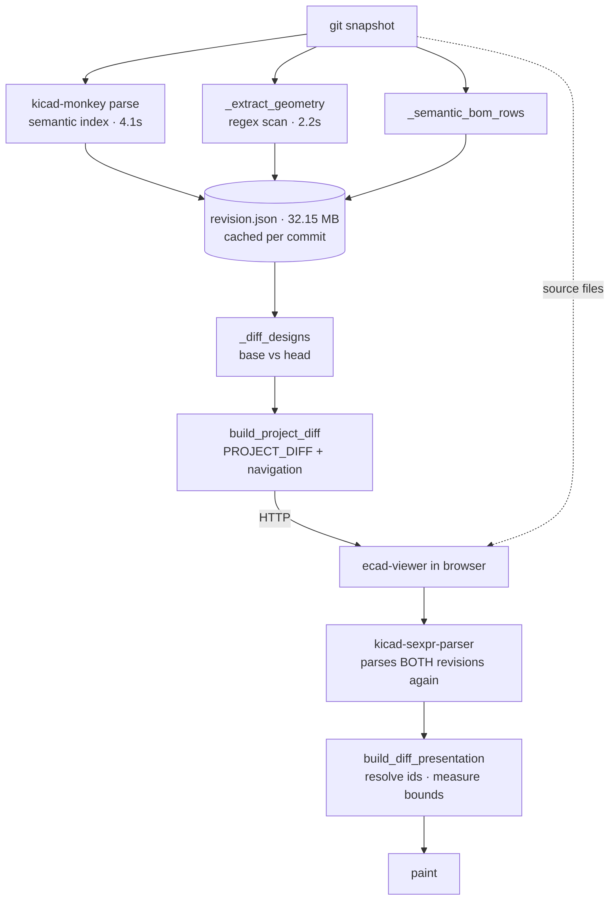
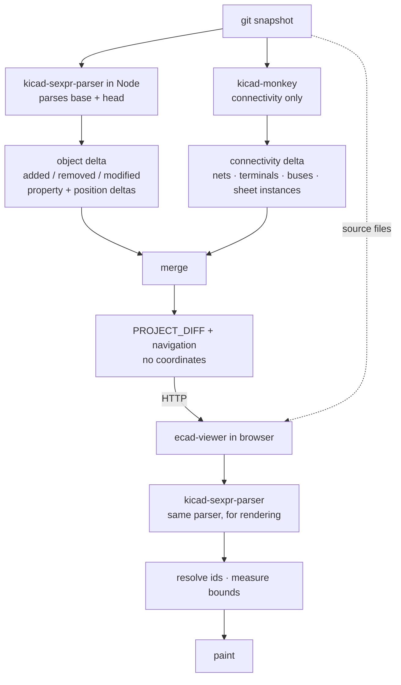

# Design Comparison: plan, revision 3

Status: implementation through M5 complete. Revision 3 re-architects around
one parser instead of four.

## Why revision 3 exists

Revisions 1 and 2 accepted, without examining it, that Prism must scan KiCad
files in Python. Under that assumption I proposed replacing
`_extract_geometry`'s regex scanning with a depth-aware object digest, built it,
and measured it. Two results killed the design:

1. The digest cost **3.6 s**, against the 2.2 s stage it was meant to replace.
2. `ecad-viewer`'s own parser — already a dependency, already `--platform=node`,
   already runnable on a Node runtime that is already in our image — parses the
   same files in **0.9 s** and returns typed objects rather than hashes.

The digest was Prism's *third* S-expression scanner, after kicad-monkey and
`_extract_geometry`. Building a fourth interpretation of the KiCad format was
never the goal; the goal was to have fewer.

**The correction: parse once, with `kicad-sexpr-parser`, on the server.**

## Measurements this plan rests on

Marked *(host)* where measured outside the worker image and *(M0)* where
[the baseline](design-comparison/m0-baseline.md) has since measured the same
thing inside it. Where the two disagree, M0 is the number to use.

| | value |
| --- | ---: |
| `kicad-sexpr-parser`, 34.9 MB board *(host)* | **639 ms** |
| `kicad-sexpr-parser`, 27 schematics / 15 MB *(host)* | **250 ms** |
| Python object digest, same inputs *(host)* | 3.6 s |
| kicad-monkey projection scan, board only *(host)* | 10.4 s |
| `_extract_geometry` *(host)* | 2.2 s |
| `_extract_geometry`, per revision *(M0)* | **5.48 s** (A) · **1.79 s** (B) |
| `build_semantic_index` *(host)* | 4.1 s |
| `build_semantic_index`, per revision *(M0)* | **6.29 s** (A) · **7.89 s** (B) |
| Cold compare, wall clock *(M0, median of 5)* | **14.08 s** (A) · **12.50 s** (B) |
| `revision.json` *(M0)* | **32.16 MB** (A) · **14.13 MB** (B) |
| Geometry share of `revision.json` *(M0)* | **84%** (A) · **51%** (B) |
| Fallback-bounds rate, 5 documents / 1,786 targets | 0.90% |
| Change-id inflation after the KIID_PATH fix *(M0)* | 1.0018× (A) · 1.0184× (B) |

The two parser figures are still *(host)*. Comparing them against the Python
stages is the argument this whole revision makes, and M0 showed those stages
cost 1.5–1.9× more in the image than the host figures said — so the comparison
has to be redone on one side of the boundary. That is M1's first job.

The parsed model already carries what the diff needs: `footprint.path` and
`symbol.instances.projects[].paths[]` (KIID_PATH), `symbol.properties`, `pins`,
`dnp`, `mirror`, `at`, and — importantly — `zone.polygons` separately from
`zone.filled_polygons`, which is the authored/generated split the digest had to
hand-roll.

## Information flow

### Today

The same bytes are parsed three times per revision, and a fourth time per
browser session.

Two consequences we have measured rather than assumed:

- The geometry sidecar exists only to fill `KiCadItemChange.bbox`, and the
  viewer replaces those bounds 99.1% of the time. It is 28.96 MB of mostly
  discarded work.
- Server and browser disagree about what objects exist. All 16 unresolvable
  `SCH_PIN`s in the Phase 0B measurement **do** parse under
  `kicad-sexpr-parser`; they are missing from the viewer's *paint index*, not
  from the parse. Two notions of identity, two bugs.

### Target

The browser still parses, because painting needs geometry in the browser. What
changes is that it no longer recomputes anything the server computed, and both
sides use **the same parser**, so an object the server names is by construction
an object the viewer can resolve. That is a correctness property, not a
performance one, and it is what the 0.90% fallback rate is really about.

### Why kicad-monkey stays

`ecad-viewer` has no netlist: `netlist`, `connectivity` and `bus_expansion` all
grep to zero hits. Net inference over a schematic — which wires, labels and
pins form one net, across sheet instances and bus expansions — is graph work
only kicad-monkey does. That is tier 1 below, it is the reason Prism is not
merely a visual differ, and it does not move.

So: **two parsers, each for what only it can do.** Not four.

### Where the Node step runs

One process per compare, parsing both revisions and emitting **only the
delta**. Shipping 44k parsed objects across the Python/Node boundary as JSON
would hand back everything the parser wins; shipping ~2.5k changes will not.

At 0.9 s per revision, caching the parse is probably not worth its complexity —
a cold compare is ~1.8 s of parsing against a 4.1 s connectivity index. M1
measures this rather than assuming it. If it holds, per-revision geometry
caching disappears and `revision.json` shrinks to the connectivity index plus
BOM rows.

## The change model, unchanged from revision 2

| Tier | Owner | Kinds |
| --- | --- | --- |
| **1 — Connectivity** | kicad-monkey | net added/removed/renamed; net membership; pin reassignment; net class; sheet instance added/removed/re-pathed; bus membership |
| **2 — Identity & properties** | Node parser | component added/removed; `lib_id` swap; footprint change; property values *and* attributes (`at`, `hide`, `effects`); DNP / exclude flags; sheet assignment |
| **3 — Geometry & graphics** | Node parser detects, **viewer resolves bounds** | moved / rotated / mirrored / layer changed; tracks, vias, zones, graphics, text, dimensions |

Tier 3 gains what the hash-based digest could not give: the parser knows an
object *moved* rather than merely *changed*, for every kind, without a special
case for components.

## Milestones

Each milestone states what it proves, how it is measured, and what must be true
before the next one starts. Benchmarks reuse
`scripts/benchmark_design_compare.py` and the existing `benchmark.mark(scope=…)`
instrumentation rather than new tooling.

Fixed benchmark inputs, so numbers stay comparable across milestones:

- **A** — JTYU-OBC `8f71cfe → 4b0a39a` (27 schematics / 15 MB, 34.9 MB board)
- **B** — backplane `05a89dd → 934be89` (1,603 sch + 459 pcb changes, reused sheets)

### M0 — Baseline harness — **done**, see [the measurement](design-comparison/m0-baseline.md)

*Proves the numbers in this plan are reproducible before anything moves.*

- Extend `benchmark_design_compare.py` to emit one row per stage for A and B:
  snapshot, semantic index, geometry, BOM, diff, project-diff, total. ✔
- Record artifact sizes and object counts alongside times. ✔
- **Target:** every figure in "Measurements" above reproduced within ±10%.
- **Gate:** two consecutive runs agree within 10%; otherwise fix the harness
  before trusting any later comparison.

**Outcome — the gate passes only in a restated form.** Three fixes were needed
first: cache isolation never reached the spawned revision workers (which had
been reporting *zero* PCB geometry objects and a 10 MB `revision.json` where
there are 18,697 objects and 31.7 MB), each run's cache was retained and made
the next run monotonically slower, and `PYTHONHASHSEED` was unpinned — worth
29.9% → 1.1% of run-to-run spread on the netlist compile alone.

Even after those, a *single* cold run is not reproducible to ±10%: measured
band is 9–28%, and `cpuMs` tracks wall clock to within tenths of a percent, so
it is real work variance rather than the scheduler. The **median of five runs**
is reproducible: two independent batches agree to 8.4% (A) and 3.4% (B).
Output is fully deterministic — identical counts and identical serialized bytes
across every run.

Two of the figures this plan quotes did not survive contact with the worker
image. `build_semantic_index` costs 6.29 s/revision on A and 7.89 s on B, not
4.1 s; cold compare is 14.08 s (A) and 12.50 s (B), not ~8.3 s. The prior
figures were host measurements. That does not change the direction of the
argument, but it does mean **the parser comparison is not yet like-for-like**:
`kicad-sexpr-parser`'s 639 ms was also measured on the host, and M1 has to
produce both sides in the image before anything is deleted.

### M1 — Node parse step, standalone — **done**, see [the measurement](design-comparison/m1-node-parse.md)

*Proves the parser runs in our image at the speed measured on the host, and
survives a real board without exhausting a worker.*

- A `scripts/ecad-parse.mjs` entry point: snapshot path in, object index out.
- Object index per object: `uuid`, `kind`, `documentPath`, `kiidPath`, `at`,
  `rotation`, `mirror`, `layer`, `net`, `properties`, plus a content hash for
  kinds with no meaningful field-level diff.
- **Benchmark:** wall clock and peak RSS for A and B, inside the backend image.
- **Target:** ≤1.2 s and ≤1.5 GB RSS for A. Object counts match the parser's
  own collection counts (982 footprints, 14,933 segments, … for A).
- **Gate:** RSS fits the worker's existing memory ceiling. If a 35 MB board
  needs more than the ceiling, decide streaming vs. raising the ceiling here,
  not later.

**Outcome — gate passes, speed target missed, and the missed target does not
matter.** Peak RSS is **1.44 GB** parsing *both* revisions of A in one process,
against the worker's actual 12 GB `mem_limit`. Streaming is not needed and the
ceiling does not move; the question this milestone was placed early to answer
is settled. Object counts reconcile exactly against every parser collection,
self-checked — the script exits non-zero on any shortfall.

Speed is **~1.8 s per revision** on A (parser ~1.2 s, index build ~0.42 s), not
≤1.2 s. The host's 639 ms carries the same ~1.9× in-image penalty M0 found on
the Python side, so both sides moved together and the ratio held. Like-for-like
in the image, per revision: Node **1.80 s** against `_extract_geometry`'s
**5.48 s** on A — but only **1.26 s** against **1.79 s** on B, a 1.4× win on
the panel that has the PCB changes. M2's claims have to be made on B.

Three bugs surfaced in the process, all of which would have shipped silently:
the parser returns `{number, name}` for nets where the declaration says
`number | string` (every copper object would have had no net, fragmenting
`position_delta`); footprint fields live in `properties_kicad_8` on KiCad 8+
(no refdes on any modern board); and treating properties as addressable
children erased every property change from a symbol's hash — closing the
property-attribute gap into a hash that could not see it.

### M2 — Object delta in Node, shadow mode — **done**, see [the measurement](design-comparison/m2-object-delta.md)

*Proves the new delta agrees with the one we ship today, before anything
depends on it.*

- Node parses base + head and emits added / removed / modified with property
  and position deltas.
- Run alongside the existing pipeline; emit both; compare sets.
- **Benchmark:** delta wall clock; agreement rate against the current
  geometry-derived change sets, per kind.
- **Target:** ≤2.5 s for A. ≥99% agreement on component, track, via and zone
  add/remove. Every disagreement classified, not merely counted.
- **Gate:** disagreements are explained and are improvements (the ~1,034
  objects in neither index today should appear as *new* detections, not as
  regressions).

**Outcome — correctness gate passes; the original speed target was impossible
after M1.** The median total Node step is **4.02 s on A** and **2.69 s on B**
(five runs); the delta calculation itself is only 0.41 s / 0.18 s. M1 had
already measured 3.59 s to parse A before a delta existed, so M2's ≤2.5 s
end-to-end target could not survive M1 and should have been restated then.

Raw agreement is 96.83% (A) and 94.76% (B), but every difference is classified
and none is a regression: connectivity-only enrichment remains with
kicad-monkey; the parser detects authored properties and addressable pads/sheet
items the geometry scanner cannot; six A-only rule-area polylines cannot reach
the viewer parser or paint index; and six B symbols are one native object that
semantic-id churn split into add/remove records. Footprint and nested-zone
agreement is 100% on B. The fixed panels contain no track or via changes, so
their add/remove mechanics are covered by real-format parser tests rather than
a percentage with a zero denominator.

M2 also found and fixed two silent index gaps: inherited pin positions were not
compared when the raw pin hash stayed constant (1,352 missed moves on B), and
zones nested inside footprints were parsed but neither indexed nor reconciled
(190 missed B changes). The M1 object counts were therefore low by 687 objects
on each A revision; the corrected counts are 43,715 / 44,454.

### M3 — Cut over; delete the geometry sidecar — **implemented; timing target missed**, see [the measurement](design-comparison/m3-node-cutover.md)

*Proves the artifact and the wall clock actually improve.*

- Delete `_extract_geometry` and the geometry sidecar. Route `documentPath`,
  `kind` and `parentSourceId` — which the sidecar also carried — from the
  object index.
- Reduce `build_semantic_index` to connectivity: components now come from the
  parser. Measure whether the 4.1 s falls.
- **Benchmark:** `revision.json` size; compare wall clock; per-stage times.
- **Target**, restated against the M0 baseline rather than the host figures
  this originally used: `revision.json` ≤6 MB on A (from 32.16 MB) and ≤7 MB
  on B (from 14.13 MB — B's sidecar is only 51% of its artifact, not 84%);
  cold wall clock ≤9.3 s on A (from 14.08 s) and ≤8.3 s on B (from 12.50 s).
  Both timings are medians of five runs; a smaller claim than ~10% cannot be
  distinguished from the measured band.
- **Gate:** `position_delta` still produced (it groups by net, so it needs a
  position for tracks, not just components); fallback-bounds rate no worse than
  0.90%; all 69 backend tests green.

**Outcome — the backend correctness and artifact gates pass; the wall-clock
target does not.** The production path now uses one `ecad-viewer` parser process for
both revisions, the Python geometry scanner and its cache payload are deleted,
component/BOM projection comes from parser objects, and semantic generation is
connectivity-only. Five-run deterministic artifacts are 2.29–2.41 MB on A and
3.51–3.55 MB on B, with zero geometry bytes. Parser centroids produce 3,059
position-delta groups on A and 2,383 on B.

Median cold total is 12.80 s (A) and 10.57 s (B), missing the 9.3/8.3 s
targets. Measurement closes the open question below: component projection was
effectively free, while connectivity `load-project` remains dominant.
Overlapping Node parsing with the two connectivity compiles avoids making both
costs additive but cannot lower the wall clock beneath connectivity's own
9–11 s initial stage.

### M4 — Fix identity resolution in the viewer — **done**, see [the measurement](design-comparison/m4-identity-resolution.md)

*Removes the reason bounds cannot yet be dropped.*

- The 16 failures are `SCH_PIN`s that parse but are absent from
  `build_paint_item_index`. Fix the paint index, not the parse.
- Re-measure across ≥8 documents including **a PCB document**, which has never
  been measured.
- **Benchmark:** fallback-bounds rate; `item-not-found` by type name.
- **Target:** 0% across all sampled documents, PCB included.
- **Gate:** M5 does not start until this is 0. At 0.90%, dropping bounds costs
  1 in 100 targets its ability to focus.

**Outcome — the gate passes.** The paint index now includes UUID-bearing pins
outside a symbol's active unit and resolves nested identities through their
painted owner. The first PCB run additionally found that modern pad UUIDs were
dropped at the parser/viewer model boundary and that hidden-layer paint bounds
were excluded from navigation; both gaps are fixed in `ecad-viewer`.

Across seven schematic documents and one PCB document, all 6,793 changes
resolved and all 11,766 targets used viewer-derived bounds. The aggregate
fallback rate is **0%**, with zero `item-not-found` failures. The PCB document
alone moved from 1,137 missing identities and 66.92% fallback to zero for both.
M5 is unblocked.

### M5 — Stop emitting bounds — **done**, see [the measurement](design-comparison/m5-stop-emitting-bounds.md)

*Completes "the backend never emits a coordinate".*

- Split the type: `NativeKiCadItemChange` keeps `bbox` required;
  `PrismItemChangeInput` makes it optional. Preparation becomes staged —
  validate, resolve, measure, then build targets.
- Unresolvable items become non-focusable change-list entries with a
  diagnostic, never `[0, 0, 0, 0]` targets at the origin.
- **Benchmark:** count of `bbox` fields in PROJECT_DIFF; artifact size.
- **Target:** zero bounds emitted; no regression in fallback rate.

**Outcome — both gates pass.** Prism now supplies identity-only change input
while native KiCad input keeps its strict required bbox. The viewer resolves
and measures parser objects after paint; unresolved identities remain
diagnostic change-list entries but never become origin targets.

The production eight-document M4 gate was rerun with no backend bounds. All
6,793 changes resolved; all 11,766 targets and 12,702 visuals used painted
bounds, with zero fallback and zero non-focusable targets. A 47,139-entry
production PROJECT_DIFF contains zero bbox fields and is at least 801,363 bytes
smaller than the same shape carrying minimal zero boxes.

### M6 — One comparison session, three views — **done**, see [the measurement](design-comparison/m6-comparison-session.md)

*Removes the second rendering path.*

- `viewer.prepareComparison()` returning a session that owns both revisions and
  all presentation state; `setPresentation("composite" | "reference" |
  "comparison")`; side-by-side over two viewports.
- Delete `buildRevisionDiffPresentation`, `setRevisionDiffPresentation`,
  `selectRevisionDiff`, `previewRevisionDiff`.
- **Benchmark:** view-switch latency; `comparison-presentation-shell.tsx` line
  count; retained viewer instances; scene memory.
- **Target:** switch ≤150 ms with no reparse; shell under 1,200 lines (from
  2,092); one preparation path.
- **Gate:** measure whether one session can drive two viewports before
  committing to the two-scene model — this is the open scope risk.

**Outcome — both gates pass.** `prepareComparison()` now owns both parsed
revisions and all three presentations. Side-by-side attaches a second viewport
to the same session without parsing; warm presentation switches restore
retained display lists and prepared targets.

On a production 329-change schematic, warm Composite, side-by-side, Old, and
New switches measured 70.6–76.7 ms with zero parser calls and zero repaints.
The shell is 1,047 lines, down from 2,092, and retains two viewer elements
instead of three. The old Prism revision-presentation builder and all three
revision-specific viewer APIs are deleted.

### M7 — Semantic completeness — **done**, see [the measurement](design-comparison/m7-semantic-completeness.md)

*Closes the gaps the measurements exposed.*

- Property *attributes* (`at`, `hide`, `effects`) — currently invisible.
- Sheet instance paths on **net** schematic refs, which is why label collisions
  survive on the backplane (8–121 entries depending on project).
- Buses and sheet instances as first-class tier-1 kinds.
- **Benchmark:** coverage count against the ~1,034 objects in neither index;
  residual change-id collisions.
- **Target:** zero unclassified objects; zero id collisions.

**Outcome — both gates pass.** Property position, visibility, and text effects
now survive the Node delta and appear as reviewable fields. kicad-monkey
projects concrete sheet instances and bus records, and net visual refs carry a
KIID path so reused sheets no longer collapse labels.

Across the four fixed snapshots, 1,261 sheet-instance and bus records are now
first-class. Fixed-input object deltas contain zero `unclassified` changes.
The final PROJECT_DIFF artifacts contain 6,089/6,089 unique scoped targets on A
and 7,634/7,634 on B: **zero duplicate targets and zero diagnostics**. Power
library symbols, including `PWR_FLAG`, are connectivity/Nets objects and are
excluded from component and BOM projection.

The reviewer-facing automatic view and evidence policy is documented in
[Reviewer presentation policy](design-comparison/reviewer-presentation-policy.md).

## Open questions, and which milestone answers each

| Question | Answered by |
| --- | --- |
| ~~Does the parser fit the worker's memory ceiling on a 35 MB board?~~ | **M1: yes — 1.44 GB against a 12 GB limit** |
| ~~Is per-revision parse caching worth its complexity at 0.9 s?~~ | **M1: probably not, but it is a 3.6 s question, not 1.8 s. Revisit after M3** |
| Does the Node delta agree with what we ship today? | M2 |
| ~~How much of the semantic index is connectivity, and how much is component projection?~~ | **M3: component projection rounds to zero; project loading/connectivity dominates** |
| What is the fallback-bounds rate on a **PCB** document? | M4 |
| Why do parsed pins not reach the paint index? | M4 |
| ~~Can one prepared session drive two side-by-side viewports?~~ | **M6: yes — two viewports, zero switch reparses** |
| Python↔Node boundary cost for a ~2.5k-change delta | M2 |

## Already landed, kept regardless

- **KIID_PATH change ids** (`35cd76f`). A reused hierarchical sheet is one file,
  so its instances share every symbol UUID; distinct components were collapsing
  onto one change id and only the last stayed selectable. Inflation 1.255× →
  1.002× (A), 1.311× → 1.021× (B).
- **Viewer generator-exhaustion fix** (`df92ecf`). `query_item_bboxes` is a
  generator that was spread twice, so per-visual bounds were never resolved and
  silently kept the caller's constant box. 0/255 visuals → 255/255.
- **Resolution instrumentation** (`fa3afb2`, `00fc93b`). Painted-bounds failure
  was previously silent; without it none of this plan's measurements exist.
- **Reproducible viewer build** (`0a657fa`).

## Reverted

`design_object_digest.py` and its tests (from `5da6993`) are gone. Superseded
entirely by M1–M2; keeping them would leave a fourth parser in the tree.

## What revisions 1 and 2 got wrong

Kept deliberately — the corrections are the useful part.

| | claim | reality |
| --- | --- | --- |
| r1 | Four viewer instances | Three; Old/New aliases one |
| r1 | ~1.5 MB digest, 40 bytes/object | ~8 MB; ~90 bytes before interning |
| r1 | One prepared scene drives all three views | Composite holds no unchanged reference items, so it cannot render a reference pane |
| r1 | Make `bbox` optional | Splitting the type is safer than weakening the native contract |
| r1 | Add `getPreparedTargets()` | Redundant; the preparation already returns the map |
| r2 | The win is "one pass instead of 18" | The 18 regex passes cost 0.52 s and were never the bottleneck; a projection scan costs 10.4 s |
| r2 | Prism must scan files in Python | It must not. That assumption produced a fourth parser |
| r2 | Fallback-bounds rate is 0 | 0.90%, entirely `SCH_PIN` |
| r2 | Each changed component is emitted twice | Records were never duplicated; their ids collided |
