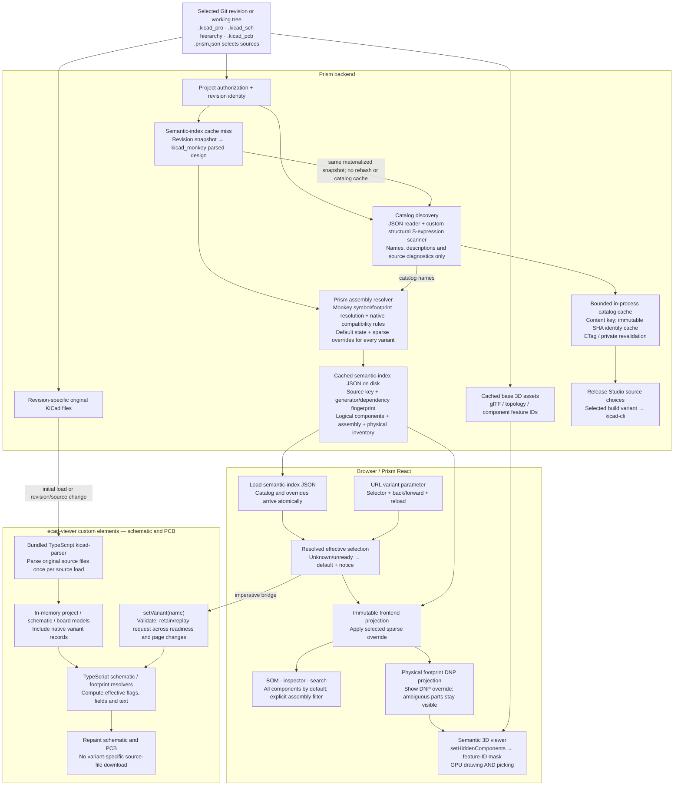

# Design-variant implementation review — 2026-09-17

Reviewed Prism `d2a5c375610719f5e7396d706f1d0d43049add78` and its pinned ECAD viewer `39daf58779eacda50c75595379145941257ea2e7`, against VAR-00 through VAR-21. Corrections are isolated on `fix/design-variants-review`, targeting `feature/design-variants`. The shared checkout and its unrelated untracked file were left untouched.

The overall architecture is sound: source-specific native semantics, immutable index projections, URL-owned selection, independent physical DNP state, and frontend viewer updates. The review found correctness and efficiency gaps below. This report distinguishes tests from unperformed product-level acceptance; it is not a merge approval before CI.

## Findings corrected

| Priority | Area / tickets | Trigger and correction |
| --- | --- | --- |
| P1 | Historical discovery — VAR-07/08/20 | Historical requests consulted current path configuration and could borrow a sibling project's board. Resolve `.prism.json` inside the selected snapshot using the common path resolver; include configuration in source identity. Historical board anchors work after the live file is deleted. |
| P2 | Catalog parsing — VAR-07 | Text regex searches could interpret quoted text, misplaced forms or nested field names as variant names. Use a quote-aware structural scanner, read each schematic once, and reject malformed relevant records or paths outside the snapshot. Metadata-free files use the explicitly documented fast path. |
| P2 | Occurrence identity — VAR-09/10 | Monkey's fallback could borrow the first occurrence's reference when the requested instance is missing. Use base attributes without mutating the native object; retain the warning. A Reference field override cannot change identity. |
| P2 | Legacy BOM flags — VAR-09 | Applying the top schematic's version gate to every child misinterpreted mixed-version hierarchies. Resolve each symbol and ancestor sheet using its containing schematic's version. |
| P2 | Physical identity — VAR-10/11/18/19 | A neutral-default PCB-only footprint was absent from both sparse default maps and logical component joins, so a named DNP override had no reference to hide. Publish and consume the complete footprint UUID/reference inventory. |
| P2 | Loading lifecycle — VAR-12/14 | Catalog/index disagreement could remain indefinitely in loading state after Sync. Eliminate the independent catalog request: load catalog and overrides atomically from the semantic index. |
| P2 | Empty selector / Assembly — VAR-14/19 | Hide the selector when there are no variants; preserve a missing-name notice. The committed Assembly artifact notice follows the requested selection and no longer asserts an unknown generation variant. |
| P2 | Release discovery — VAR-20 | A board-only project had no `.kicad_pro` and therefore no Release Studio variants. Discover using its board or schematic anchor. |
| P2 | Cache correctness — VAR-08 | Moving refs were given immutable-style max-age, and two different commits with identical source content could share response identity. Revalidate all URLs, including exact SHAs; include full response metadata and generator identity in the ETag and sanitize operational errors. |
| P2 | Reproducible fixtures — VAR-01/21 | The manifest required ten ignored, uncommitted `.kicad_prl` preference files. Remove only those entries; native inputs, evidence, and expected values stay unchanged. |

## Original correction performance (through c91489e)

Before the original correction, catalog discovery archived the entire repository, reread schematics, and repeated scanning on every request, including conditional requests. The correction materializes only regular KiCad source/configuration blobs in a single Git batch, scans relevant structure, and caches small catalog results in a bounded per-process LRU (128 entries). Exact-SHA identities have a separate bounded cache (512 entries). Authorization still runs before every API request. Working-tree sources are hashed each time and checked again before a cold result is cached; a concurrent edit causes a retryable error rather than poisoning an old key.

Median elapsed milliseconds over seven cold/warm pairs on the same workstation and local project corpus. Cold clears both new caches; warm repeats the same request. These are service-call measurements, excluding HTTP, browser paint, full Monkey parsing and initial 3D generation. They are not production latency promises.

| Project | Source | Cold, before → after (ms) | Repeated, before → after (ms) |
| --- | --- | ---: | ---: |
| USB-PD-Trigger-Board | working tree | 40.60 → 54.55 | 42.25 → 10.47 |
| USB-PD-Trigger-Board | exact commit | 189.36 → 151.00 | 191.64 → 0.02 |
| openswitch-10x10g-carrier | working tree | 271.31 → 239.53 | 271.81 → 11.83 |
| openswitch-10x10g-carrier | exact commit | 399.33 → 365.58 | 403.52 → 0.02 |
| cynthion-hardware | working tree | 201.52 → 191.49 | 202.78 → 16.21 |
| cynthion-hardware | exact commit | 356.29 → 289.91 | 356.76 → 0.01 |

USB has one real variant. OpenSwitch (about 10.7 MB of KiCad files, 326 footprints) and Cynthion (about 8.3 MB) exercise the important large-board/no-variant path. Cold USB working-tree discovery is modestly slower because of structural scanning and the second consistency hash. Repeated requests improve substantially; exact-SHA hot requests avoid Git entirely. Cache entries are process-local and disappear on restart.

An additional overlay stress probe used OpenSwitch's parsed native design and 20 synthetic unchanged variants. It showed approximately 0.93–0.95 seconds with tracemalloc enabled and 17.57 MiB peak in both versions. There is **no measured overlay speed or peak-memory improvement** to claim. The code no longer retains full resolved component/footprint maps for every variant solely for later diagnostics, but source reading dominated this probe's peak. Full native parsing and O(variants × occurrences) resolution remain separate costs. The new complete inventory adds roughly 23 KB uncompressed for this board; the sparse overlays remain sparse.

## Ticket disposition

| Tickets | Review disposition |
| --- | --- |
| VAR-00 | Native rules and product decisions preserved. Additive inventory clarification below. |
| VAR-01 | Native fixture evidence retained; clean-checkout manifest defect corrected. |
| VAR-02/03 | Parser and serializer preserve absent versus explicit false tokens; parser tests passed. |
| VAR-04/05/06 | Reviewed schematic/PCB resolvers and repaint lifecycle, including merged repaint fix; browser tests passed. No new ECAD source changes. |
| VAR-07/08 | Corrected structural discovery, revision configuration, extraction costs, caches and response identity. |
| VAR-09/10 | Corrected missing occurrences, mixed-version BOM semantics, reference identity and physical inventory. |
| VAR-11/12 | Corrected physical projection and removed the redundant catalog request; immutable logical projection retained. |
| VAR-13 | All-components BOM default and explicit assembly filter retained; effective fields continue into BOM/details/search. |
| VAR-14 | Corrected empty/missing states; URL remains selection authority. |
| VAR-15/16 | Pinned ECAD source and imperative bridge reviewed; selection is replayed after readiness/source changes. No bundle changes required. |
| VAR-17 | Real WebGPU color/pick readback passed through hide/show and mask growth. |
| VAR-18/19 | Controller tests cover ambiguity/replay/selection; added missing physical identity. Show DNP remains a local visibility override. |
| VAR-20 | Shared discovery now covers board-only sources. Legacy Default-name collision is explicitly deferred by the user. |
| VAR-21 | Broader independent test evidence recorded below. Full interactive cross-view scenario matrix remains a separate acceptance limit. |

## Additive wire clarification

`assembly.footprintInventory?: Array<{uuid: string, reference: string}>` carries complete physical identity independently of sparse flags. New indexes emit it. The simplification pass below removes the legacy membership fallbacks because generator fingerprints invalidate those older artifacts. No flag precedence or product behavior is redefined. The generator build fingerprint changes, invalidating older generated index artifacts. This is an additive clarification to packet v1 section 3.2; the frozen packet itself is not silently rewritten.

## Original correction verification (c91489e)

- Backend, final correction sources: **1,430 tests, OK; 14 live-KiCad skips**. All PostgreSQL URL classes were configured against disposable databases. A previous rerun against a used catalog database failed seven unrelated import-remediation fixture cases; the complete fresh-database run passed.
- Strict Release Studio live runner: **43 tests, OK, zero skips**, in `release-studio-live-kicad:checkpoint-fix` with read-only corrected app/tests. Baked KiCad identity: `kicad/kicad:10.0.4@sha256:ee71e88396f8563168eb1ef282cda9ff2670fe86a677c63dd78b35e3d464454c`. The first attempt with the development ARM image correctly failed the digest identity gate; no check was weakened. This uses the existing pinned runtime image, not a freshly rebuilt correction image.
- Frontend: **101 files / 782 tests passed**; lint, React Doctor gate (0 warnings / 0 errors), application build and panel build passed. Final formatting/type changes also passed lint, scan and application build.
- Pinned ECAD source: **134 parser tests and 221 browser viewer tests passed**. Initial sandbox server startup was denied; the supported test runner then passed on a separate authorized port.
- Semantic viewer: **8 glTF tests, 41 viewer tests and 43 topology Python tests passed**; real WebGPU evidence below. No renderer or generated bundle was modified.
- Python compilation, architecture ratchet, agent-document checker and `git diff --check` passed.
- GitHub PR checks: inspect the live correction PR before merge; local results do not replace CI.

The real GPU probe draws feature 42, reads an actual canvas pixel and pick result, hides it, grows the mask to include ID 8192, then restores/hides/restores it. Visible color `[0,0,214,255]` and pick `42`; hidden background `[240,237,232,255]` and pick `0`; all six steps passed with no GPU validation error. This exercises the production renderer, not a mock. Controller unit tests cover clearing selection and ambiguous references. It does not substitute for the entire interactive BOM/inspector/search/Release Studio scenario matrix.

The committed KiCad 10.0.6 native oracle evidence was checked by the fixture suites; this review did not regenerate all oracle exports. The user's USB-PD manual validation is additional evidence, not an independent run by this reviewer.

## Follow-ups and limits

- **REL-VARIANT-DEFAULT:** Support a real variant named `Default` in Release Studio. The legacy case-insensitive `default` sentinel currently hides such names and suppresses `--variant`. User explicitly chose to defer this migration. Define an unambiguous default representation, migrate saved configuration/API/UI/CLI handling together, and test `default`, `Default`, empty/default assembly, and round trips of existing configurations.
- **TEST-DB-REUSE:** Import remediation integration fixtures deactivate their components but reuse fixed manufacturer/MPN identities. Rerunning against the same disposable catalog database produces identity collisions. Use a fresh database; fix fixture isolation separately from this feature.
- Rule-area-driven population remains diagnostic-only and ambiguous alternate-footprint models remain visible, as approved in the contract. No geometry substitution is implemented.
- Full live cross-view interaction acceptance and the final GitHub quality gate are still required before promoting the feature to `dev`. This correction PR does not merge the feature.
## Dataflow after the correction

Selecting a variant does not ask the backend to generate replacement schematic or PCB files. ECAD independently resolves its already parsed source records in TypeScript. Prism's BOM and 3D visibility instead use the backend-generated assembly data. These are two semantic implementations, tested against shared native fixtures. Catalog discovery adds a third, deliberately limited scanner that extracts names rather than resolving component state. A cold semantic-index build still uses its existing full snapshot/Monkey path; the selective Git extraction optimization in this PR is for catalog discovery.

## Opus review validation and simplification — 2026-09-18

The major duplication and performance findings were valid. This pass changes
the implementation in the same correction PR, against `c91489e`, without
changing variant precedence, BOM policy, DNP policy or Release Studio's default
sentinel.

| Finding | Disposition |
| --- | --- |
| A / 2.4 / flash-to-default: separate catalog request despite waiting for the index | Removed `useProjectVariants`, its request lifecycle and revision reconciliation. The visualizer now takes both catalog and overlays from one index. A usable index remains selected during a refresh error. The independently authorized endpoint remains available. |
| B: replace the imperative viewer bridge with an attribute | Not equivalent for Prism's progressive loading. ECAD marks the root loaded and validates the request before support files arrive; an unknown name clears the stored request and reflected attribute. Appending the defining project/child file then replays null, and React has no changed prop to restore. Retain ready-time replay and mismatch reporting. This conclusion is from the pinned element lifecycle, not a new browser acceptance run. |
| C: unused occurrence and flag wire maps | Retain the frozen contract. Occurrence resolution also feeds component projection, so removing the serialized occurrence map would not eliminate the semantic calculation. Catalog is now consumed directly. Diagnostics presentation remains a follow-up. |
| D: physical classification merges five identity sources | Use only the complete `assembly.footprintInventory`; sparse flag maps provide DNP values, not membership. Remove the unused inventory argument and old-index fallbacks. Duplicate references stay ambiguous; orphan footprints remain supported. |
| E / 2.2: duplicate revision helpers and repeated Git plumbing | Valid maintenance opportunity, deferred to one shared revision/snapshot abstraction. Merging the private helpers also changes PCB-only versus project-anchor behavior across index consumers. It is no longer on the index catalog path after this pass. Exact-SHA warm lookup remains cached. |
| F: configuration cache write-then-clear | Add `store=False` for snapshot discovery, preserving any live-project cache entry and avoiding temporary-path entries. |
| F: project ID in catalog cache key | Stamp project ID after the cached result, so multiple project views of the same path/anchor share discovery without leaking identity. |
| F: repeated default occurrence dictionary | Build once before the variant loop. |
| F: Release Studio root/anchor wrappers | No change: small cleanup with no measured benefit, outside this pass's dataflow simplification. |
| 2.1: metadata-free structural scan | Add a conservative regex precheck accepting whitespace after `(`; skip the structural walk when no relevant record or sheet link can exist. Quoted false positives still take the structural path. |
| 2.3 / consistency-check failure during index build | Call `discover_snapshot_catalog` directly on the builder-owned snapshot. No fake project, double source hash, temporary-path LRU entries or catalog-specific working-tree consistency exception. The independent endpoint still checks working-tree consistency. Do not catch and silently drop the catalog. |
| 2.5: skip unchanged occurrence resolution | Deferred. Preserve native inheritance semantics; this was not the measured bottleneck. |
| Exact-SHA HTTP freshness after deploy | All catalog responses now use `private, no-cache` with ETags. Generator changes revalidate immediately; unchanged responses can still return 304. |
| URL Back behavior / real variant named Default | Preserve the existing replace-history choice and the user's explicitly deferred Release Studio sentinel migration. |

### Discovery boundary

The metadata-free fast path deliberately does not certify that an entire KiCad
file is syntactically valid. A malformed file without any relevant token no
longer produces a catalog `source-unparseable` diagnostic. Relevant malformed
records still do, and native model parsing during index generation/rendering
is unchanged. The regression tests record this boundary rather than claiming
full validation. The malformed native fixtures and catalog ordering/case rules
remain covered.

### Independent performance measurements

Local Jetson AGX Thor baseboard: approximately 85 MB PCB plus 13 MB schematics,
zero variants. Same Python runtime, before `c91489e` versus this pass, five
samples per mode, medians in milliseconds. Clear both in-process caches before
each cold sample; immediately repeat for warm samples. OS filesystem caches
were not flushed. No concurrent heavy tests were running during the samples.

| Catalog request | Before cold | After cold | Before warm | After warm |
| --- | ---: | ---: | ---: | ---: |
| Working tree | 2443.20 | 251.65 | 59.15 | 59.89 |
| Exact SHA | 2870.36 | 684.80 | 0.02 | 0.02 |
| Branch (`HEAD`) | 2809.06 | 641.94 | 76.53 | 73.58 |

This is approximately 9.7x faster cold working-tree discovery and 4.2x faster
cold exact-SHA discovery. It is not a measurement of total semantic-index build
or viewer load time. Files containing relevant variants still use the
structural scanner. Large variant-bearing boards and a shared Git snapshot
plan are the next useful performance targets.

### Validation for the simplification

- Backend: **1,435 tests passed, 14 live-KiCad skips**, with all three PostgreSQL database URLs configured against fresh disposable databases.
- Frontend: **100 files / 770 tests passed** on the prescribed Node 22 runtime. The first invocation used the host's default Node and failed unrelated browser-storage tests; the supported runtime passed. Removed hook tests account for the lower count.
- Frontend lint, React Doctor gate (0 warnings / 0 errors), application build and panel build passed.
- Python compilation, agent-document checker, catalog architecture check against `c91489e`, and `git diff --check` passed.
- ECAD and semantic renderer source/bundles are unchanged; their prior run evidence is listed separately above. No new full interactive product acceptance run is claimed.
- The exact-head GitHub quality-gate result is recorded on PR #300; it includes the containerized live-KiCad acceptance gate. Local results alone are not merge approval.
